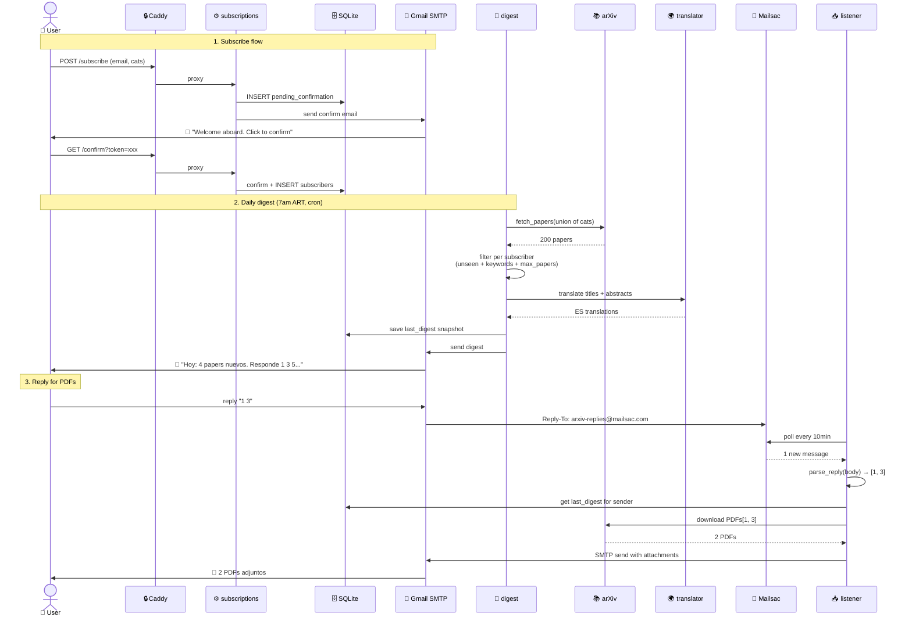

# Arquitectura — The Daily Abstract

## Diagrama (Mermaid)

```mermaid
graph TB
    subgraph Internet["🌐 Internet"]
        USER[👤 Usuario]
        GMAIL[📧 Gmail SMTP<br/>500/día free]
        MAILSAC[📨 Mailsac inbox<br/>1500 polls/mes]
        ARXIV[📚 arXiv API]
        MYMEM[🌍 MyMemory<br/>50k chars/día]
        HC[❤️ healthchecks.io]
        GDRIVE[💾 Google Drive<br/>backup off-VM]
    end

    subgraph VM["🖥️ Oracle Cloud E2.1.Micro · 1 GB RAM · $0/mes"]
        CADDY[🔒 caddy<br/>TLS auto<br/>:80 :443<br/>50MB limit]
        SUB[⚙️ subscriptions<br/>FastAPI :8000<br/>150MB limit]
        DIGEST[📰 digest<br/>cron daily 7am<br/>100MB limit]
        TRANS[🌍 translator<br/>FastAPI :8001<br/>120MB limit]
        LIST[📥 listener<br/>poll 10min<br/>150MB limit]

        subgraph Volume["📦 ./data volume"]
            DB[(🗄️ SQLite WAL<br/>subscribers.db<br/>replies_processed.db)]
            ARCH[📂 archive/<br/>{cat}/{date}.json]
        end
    end

    USER -->|HTTPS| CADDY
    CADDY -->|proxy_pass| SUB
    SUB -.->|read/write| DB
    SUB -.->|read| ARCH

    DIGEST -->|cron 07:00 ART| ARXIV
    DIGEST -->|translate batch| TRANS
    TRANS -->|cache + fetch| MYMEM
    DIGEST -->|read subs| DB
    DIGEST -->|write papers| ARCH
    DIGEST -->|SMTP send| GMAIL
    GMAIL -->|📩 digest email| USER

    USER -->|✉️ reply '1 3 5'| GMAIL
    GMAIL -->|Reply-To| MAILSAC
    LIST -->|poll API| MAILSAC
    LIST -->|read snapshot| DB
    LIST -->|download PDFs| ARXIV
    LIST -->|SMTP attach| GMAIL
    GMAIL -->|📎 PDFs| USER

    DIGEST -.->|ping ok/fail| HC
    HC -.->|alert email<br/>si 25h sin ping| USER

    Volume -->|cron 11am UTC<br/>tar.gz + rclone| GDRIVE

    style USER fill:#ede9e0,color:#1a1a1a,stroke:#b97f3d
    style VM fill:#1a1e23,color:#ede9e0,stroke:#b97f3d
    style Volume fill:#20252b,color:#d99c5e,stroke:#b97f3d
    style GMAIL fill:#f4f1ea,color:#1a1a1a
    style MAILSAC fill:#f4f1ea,color:#1a1a1a
    style ARXIV fill:#f4f1ea,color:#1a1a1a
```

## Flujo: Subscribe → Confirm → Digest → Reply → PDFs



## Decisiones clave

| Decisión | Por qué | Alternativa rechazada |
|---|---|---|
| **5 containers vs monolito** | Lifecycles distintos (cron, web, poll). Restart selectivo. Memory limits por servicio. | App Python monolítica con threads — más simple pero acoplada |
| **SQLite con WAL** | Cero infra. WAL = concurrent reads. 1-1000 users fit. | Postgres — overkill al inicio |
| **Caddy en lugar de nginx** | TLS automático Let's Encrypt sin config | nginx + certbot manual |
| **Gmail SMTP vs Resend/Postmark** | FreeDNS sin DKIM bloquea providers modernos. Gmail App Password funciona | Resend (requiere domain auth) |
| **Mailsac inbox single** | Mapea sender→subscriber con DB lookup. No necesita SES inbound | AWS SES inbound — más complejo |
| **MyMemory translator** | Free tier 50k chars/día. Wrapper microservice cachea por hash de texto | OpenAI o DeepL — pagos |
| **Oracle Free Tier** | E2.1.Micro AMD, 1 GB RAM, $0/mes indefinido | GCP/AWS — costo o complejidad |
| **Mailhog para dev** | SMTP local, capture in browser. Mismo `docker-compose.yml` que prod | mocks de Python — menos fiel |

## Por qué Docker resolvió esto (vs sin Docker)

1. **Reproducibilidad** — `docker compose up` y el stack entero arranca
   igual en Mac, en CI, en Oracle. Cero "funciona en mi máquina".
2. **Memory limits declarativos** — un container malformed no se come la
   VM entera. `limits: memory: 100M` y listo.
3. **Healthchecks integrados** — Docker sabe automáticamente cuándo un
   container está roto y `restart: always` lo cicla.
4. **Volumes** — code (image, immutable) separado de data (volume, persiste).
5. **Networks** — los services se comunican por nombre DNS interno
   (`http://subscriptions:8000`) sin exponer puertos al host.
6. **Push to registry** — `docker compose pull` en VM es atomic, rollback
   trivial.
7. **Dev = prod** — el mismo YAML, diferentes `.env`. La única
   diferencia: dev usa MailHog (1 container extra), prod usa Gmail SMTP.

## Lo que NO usé y por qué

| | Por qué no |
|---|---|
| **Kubernetes** | Para 1 VM con 5 containers, docker-compose hace lo mismo con 90 líneas vs 500. K8s tiene sentido a partir de N pods replicados. |
| **Service mesh (Istio, Linkerd)** | 5 servicios no justifican mTLS automático. |
| **Message queue (Redis, RabbitMQ)** | El flujo es sync simple. La SQLite hace de queue lookup para el listener. |
| **API Gateway** | Caddy ya hace reverse proxy + TLS + headers. |
| **Logging stack (ELK, Loki)** | `docker logs` + Healthchecks.io alertas. Para 1 user es suficiente. |
| **CI/CD platform** | Build + push manual desde mi Mac. CI a futuro si hay PRs. |
| **Multi-region** | 1 VM en Santiago Chile, latencia OK para AR/Latam. |
